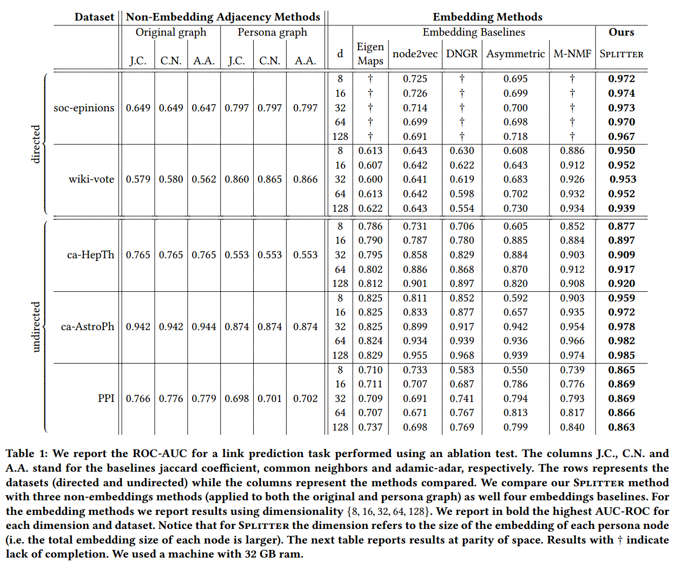
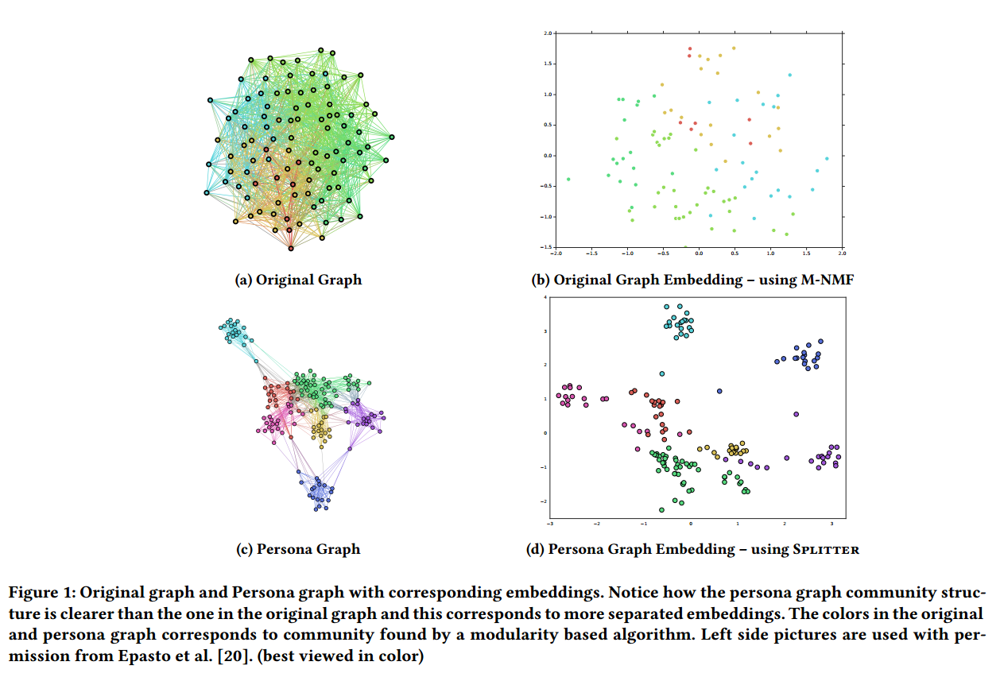

# Deadline
02.02.2022 04:00 (night)
# Is a single Embedding Enough? Learning Node Representations that Capture Multiple Social Contexts
This project is based on two papers, one directly and another one indirectly:
1. **Main Paper**: [*Is a Single Embedding Enough? Learning Node Representations that Capture Multiple Social Contexts*](https://arxiv.org/abs/1905.02138)
2. **Extension**: [*Ego-splitting Framework: from Non-Overlapping to Overlapping Clusters*](https://www.kdd.org/kdd2017/papers/view/ego-splitting-framework-from-non-overlapping-to-overlapping-clusters)

# Resources and Codes of the Mentioned Papers
1. **SPLITTER**: https://github.com/benedekrozemberczki/Splitter
2. **Persona Graph**: https://github.com/google-research/google-research/tree/master/graph_embedding/persona

# Datasets Used
1. **Epinions social network**: [soc-epinions](https://snap.stanford.edu/data/soc-Epinions1.html)
2. **Wikipedia vote network**: [wiki-vote](https://snap.stanford.edu/data/wiki-Vote.html)
3. **High Energy Physics - Theory collaboration network**: [ca-HepTh](https://snap.stanford.edu/data/ca-HepTh.html)
4. **ca-AstroPh**: [Astro Physics collaboration network](https://snap.stanford.edu/data/ca-AstroPh.html)
5. **Human Protein-Protein interaction network**: [PPI](https://snap.stanford.edu/biodata/datasets/10000/10000-PP-Pathways.html)

# Baselines
## Non-embedding Baselines
1. [**Jaccard Coefficient (J.C.)**](https://networkx.org/documentation/stable/reference/algorithms/generated/networkx.algorithms.link_prediction.jaccard_coefficient.html)
2. [**Common Neighbours (C.N.)**](https://networkx.org/documentation/stable/reference/generated/networkx.classes.function.common_neighbors.html)
3. [**Adamic Adar (A.A.)**](https://networkx.org/documentation/stable/reference/algorithms/generated/networkx.algorithms.link_prediction.adamic_adar_index.html#networkx.algorithms.link_prediction.adamic_adar_index)

## Embedding Baselines
1. [**_Laplacian EigenMaps_**](https://github.com/JAVI897/Laplacian-Eigenmaps)
2. [**_Node2Vec_**](https://github.com/aditya-grover/node2vec)
3. [**_DNGR_**](https://github.com/apoorvavinod/DNGR)
4. [**_Asymmetric_**](https://github.com/google/asymproj_edge_dnn)
5. [**_M-NMF_**](https://github.com/benedekrozemberczki/M-NMF)

# Claims 
## Abstract
- [ ] 1. <ins>reducing the error</ins> in link prediction by up to **90%**.
- [ ] 2. <ins>effective visual analysis</ins> of the learned community structures.

## Introduction
- [ ] 1. **_ego-net based_** techniques <ins>can lead to improvements</ins> in embedding methods as well. (P. 5)
- [ ] 2. a **natural embedding method** based on the **_persona graph_** <ins>outperforms</ins> many embedding baselines in the task of <ins>link prediction</ins>. (P. 5)

## Task: Link Prediction
- [X] Link prediction (network reconstruction) is the best way to analyze an unsupervised network embedding's performance; as it is a primary task (unlike node classification - a secondary task that involves a labeling process that may be uncorrelated with the graph itself).

## Experimental Results
### Non-embedding Methods
- [ ] 1. Simply applying the **_persona_** preprocessing to the non-embedding baselines <ins>does not consistently improve</ins> the results over using them in the original graph.
   - **improvements** were <ins>only observed in two of five datasets</ins>.
   - <ins>sometimes even **strong losses**</ins> happened in applying this simple preprocessing, especially for sparse graphs such as **_ca-HepTh_**.
   - This confirms that the gains observed in **_SPLITTER_** do not come merely from the preprocessing.

### Embedding Methods
- [ ] 1. <ins>at the same level of dimensionality</ins>, **_SPLITTER_** <ins>always outperforms</ins> all other baselines.
   - the improvement is particularly significant in the largest graph **_epinions_** where **_SPLITTER_** using size 8 embeddings improves AUC-ROC by a factor of **40%** (90% reduction in error) even when compared with the best baseline with 128 dimensions.
- [ ] 2. achieving <ins>close to optimal performance</ins> in two of the other largest graphs, **_wiki-vote_** and **_ca-AstoPh_**.
- [ ] 3. AUC-ROC of **_SPLITTER_** is <ins>higher than every other baseline</ins> using about **16pbar** (average number of personas per node) dimensions for all datasets, <ins>except one</ins> which is **_M-NMF_** on **_ca-HepTh_** dataset.

<!--  -->

  

### Task: Visualization
- [ ] 1. the **_persona graph_** community structure <ins>is clearer</ins> than the one in the original graph.
- [ ] 2. <ins>more separated embeddings</ins> (in 2D) in contrast to **_M-NMF_**.

  

